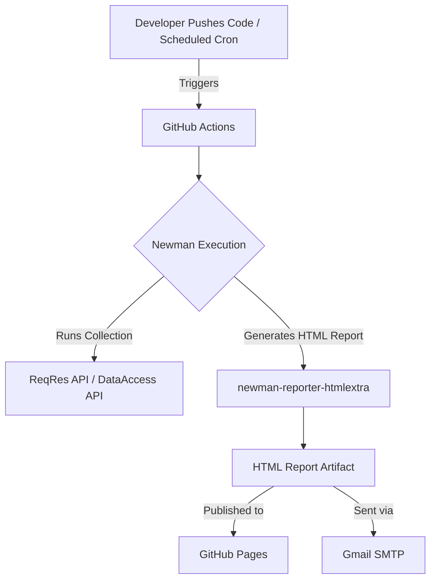

# API Testing Architecture & Documentation

## Overview
This document provides a comprehensive overview of the Postman API automation framework integrated with GitHub Actions. It details the architecture, data flow, and the specific API endpoints being tested, primarily focusing on the ReqRes API and a SOAP Number Conversion service.

## Architecture and Data Flow

The testing framework leverages Postman for test authoring and Newman for CLI execution within a Continuous Integration (CI) environment.



## Environment Configuration

The framework utilizes Postman environment variables for flexible execution across different environments. Key variables include:
- `{{url}}`: The base URL for the API endpoints (e.g., `https://reqres.in`).

## API Endpoint Details

The `reqres` Postman collection includes the following endpoints:

### 1. List Users

- **Description**: Retrieves a paginated list of users.
- **Method**: `GET`
- **URL**: `{{url}}/api/users?page=2`
- **Testing Specifications**:
  - Validates response status code is `200 OK`.
  - Verifies `Content-Type` header includes `application/json`.
  - Ensures the presence and structure of the `support` object.
  - Confirms the `data` array exists and contains at least one element.
  - Validates `id` is a non-negative integer.
  - Checks that the `avatar` field is a valid URL format.
  - Ensures the response body is not empty.
- **Visualizer**: Uses Postman Visualizer to render the user list in an HTML table format.

### 2. Create User

- **Description**: Creates a new user record.
- **Method**: `POST`
- **URL**: `{{url}}/api/users`
- **Request Body** (JSON):
  ```json
  {
      "name": "morpheus",
      "job": "leader"
  }
  ```
- **Testing Specifications**:
  - Validates response against a JSON schema (requires `name`, `job`, `id`, and `createdAt`).
  - Verifies `Content-Type` is `application/json`.
  - Asserts response time is less than 1000ms.

### 3. Update User

- **Description**: Updates an existing user's information completely.
- **Method**: `PUT`
- **URL**: `{{url}}/api/users/2`
- **Request Body** (JSON):
  ```json
  {
      "name": "morpheus",
      "job": "leader"
  }
  ```
- **Testing Specifications**:
  - Validates response status code is `200 OK`.
  - Verifies response has required fields: `name`, `job`, and `updatedAt`.
  - Ensures `name` and `job` are non-empty strings.
  - Validates `job` format is a string.

### 4. Patch Update

- **Description**: Partially updates a user's information.
- **Method**: `PATCH`
- **URL**: `{{url}}/api/users/2`
- **Request Body** (JSON):
  ```json
  {
      "name": "morpheus",
      "job": "zion resident"
  }
  ```
- **Testing Specifications**:
  - Validates the length of `name`, `job`, and `updatedAt` properties are greater than zero.
  - Asserts response time is less than 1000ms.

### 5. Delete User

- **Description**: Deletes a specific user record.
- **Method**: `DELETE`
- **URL**: `{{url}}/api/users/2`
- **Testing Specifications**:
  - Verifies the response data length is empty (null).

### 6. Number to Words (SOAP)

- **Description**: A SOAP web service that converts a given number into its word representation.
- **Method**: `POST`
- **URL**: `https://www.dataaccess.com/webservicesserver/NumberConversion.wso`
- **Headers**:
  - `Content-Type`: `text/xml`
  - `SOAPAction`: `"#POST"`
- **Request Body** (XML):
  ```xml
  <?xml version="1.0" encoding="utf-8"?>
  <soap:Envelope xmlns:soap="http://schemas.xmlsoap.org/soap/envelope/">
    <soap:Body>
     <NumberToWords xmlns="http://www.dataaccess.com/webservicesserver/">
       <ubiNum>500</ubiNum>
     </NumberToWords>
    </soap:Body>
  </soap:Envelope>
  ```
- **Testing Specifications**:
  - Validates `Content-Type` is `text/xml`.
  - Verifies the structure contains the `soap:Envelope`.
  - Checks for the expected `xmlns:m` namespace in `M:NumberToWordsResponse`.
  - Ensures the `m:NumberToWordsResult` is not empty.
