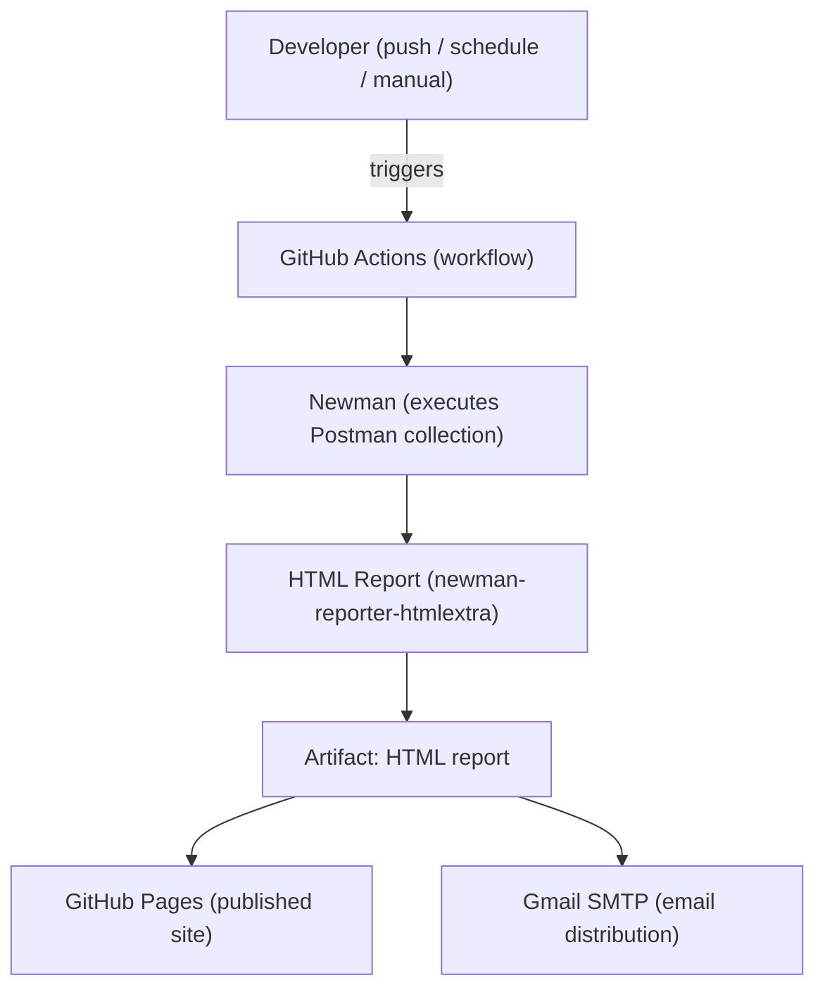
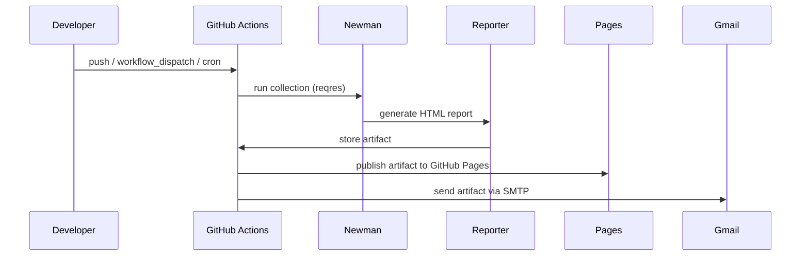

# Executive Summary

This repository demonstrates a Postman-based API automation pipeline that runs Postman collections (reqres) with Newman inside GitHub Actions. Test runs produce an HTML report (via newman-reporter-htmlextra) which is archived as build artifacts, published to GitHub Pages, and optionally emailed via Gmail SMTP. The project uses Postman environment variables (Environmentreqres.postman_environment.json) to make the collection portable across environments.

# Architecture Overview

The architecture is straightforward: developer actions (push / schedule / manual) trigger GitHub Actions, which run Newman to execute the Postman collection. Newman generates an HTML test report which the workflow stores as an artifact and publishes to GitHub Pages and/or sends via email.

Refer to the editable draw.io diagrams in docs/diagrams/ for an editable visual model. Because automatic draw.io -> PNG export is not performed in this run, this Markdown includes Mermaid fallbacks that render the same concepts.

Files referenced:
- `README.md` — repo overview and GitHub Pages link
- `API_DOCUMENTATION.md` — detailed API testing architecture and endpoint descriptions
- `reqres.postman_collection.json` — Postman collection with test scripts
- `Environmentreqres.postman_environment.json` — environment variables ({{url}} -> https://reqres.in)


## High-Level Architecture (Mermaid fallback)



# Processing Pipeline

The processing pipeline follows a linear flow: Trigger -> Execute -> Report -> Publish/Notify.


## Pipeline (Mermaid fallback)



# Core Components

This project is primarily a CI/CD test harness composed of:

- Postman collection: `reqres.postman_collection.json` — contains requests and in-collection test scripts (listed endpoints: List Users, Create User, Update User, Patch Update, Delete User, NumberToWords SOAP)
- Postman environment: `Environmentreqres.postman_environment.json` — defines `{{url}}` (https://reqres.in)
- Newman: CLI runner used by the GitHub Action to execute the collection
- newman-reporter-htmlextra: Reporter plugin that generates an HTML test report
- GitHub Actions workflow: (expected under `.github/workflows/` — triggers on push, workflow_dispatch, and cron according to README)


## Component relationships (high level)

- The GitHub Actions workflow checks out the repo and installs Node.js, Newman, and the reporter.
- Newman runs the collection and uses the environment file to resolve `{{url}}`.
- Test scripts in the collection validate response schemas, headers, response times, and set up a visualizer for the List Users endpoint.

# API Contracts / Message Schemas

See `API_DOCUMENTATION.md` for per-endpoint expectations and schema fragments (JSON and XML). Notable checks implemented in the collection tests:
- Status codes (200 for most GET/POST/PUT/PATCH)
- Content-Type header validations (application/json, text/xml for SOAP)
- JSON schema validation for Create User
- Response time assertions (< 1000ms in several tests)

# Infrastructure & Deployment

- CI: GitHub Actions (configured to archive HTML artifacts and publish to GitHub Pages)
- Hosting: GitHub Pages serves the published HTML report (see README link)
- Notification: Gmail SMTP used by the workflow to email reports

# Extension Patterns

To add a new API endpoint test:
1. Add a new item to `reqres.postman_collection.json` (use the existing request blocks as templates).
2. Add or reuse assertions from other requests (status, schema, headers).
3. If the new endpoint requires configuration, add a variable to `Environmentreqres.postman_environment.json` and reference it with `{{var}}` syntax.

# Rules & Anti-Patterns

Do:
- Keep secrets out of checked-in files — use GitHub Secrets for credentials (SMTP password, if used).
- Reuse environment variables for base URLs and credentials.

Don't:
- Commit real credentials or tokens to the repository.
- Run long-running or flaky external API calls as part of every push without appropriate controls.

# Dependencies

This project uses:
- Postman (collection format v2.1)
- Newman (CLI runner) — used in the workflow
- newman-reporter-htmlextra — HTML reporter plugin

# Code Structure

```
- README.md
- API_DOCUMENTATION.md
- reqres.postman_collection.json
- Environmentreqres.postman_environment.json
- .github/ (workflows expected here)
```

# Notes & Next Steps

- I created editable draw.io files under `docs/diagrams/` but did not generate PNG exports in this run. If you want PNGs and a .docx, I can attempt to export diagrams to PNG and run the md-to-docx converter (it requires the repo's bundled export scripts and a Node environment).

Generated files (in this commit):
- `docs/project-summary.md`
- `docs/diagrams/high-level-architecture.drawio`
- `docs/diagrams/processing-pipeline.drawio`
- `docs/diagrams/component-relationships.drawio`
